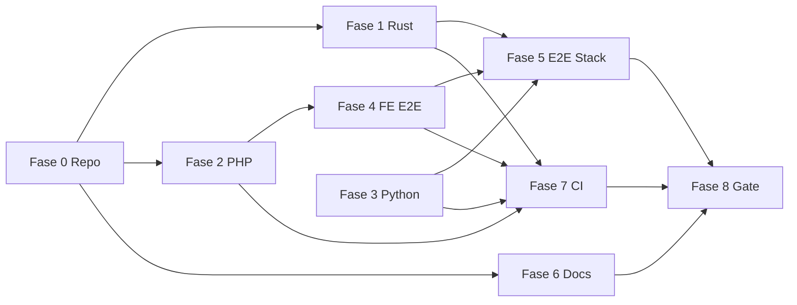

# Piano operativo — Archivio ParlanteX

| Metadato | Valore |
|---|---|
| **Data piano** | 2026-05-25 |
| **Repository** | `c:\Users\aj_93\OneDrive\Documenti\GitHub\Archivio-parlanteX` |
| **Branch di lavoro** | `develop` |
| **HEAD al momento del piano** | `7812364` |
| **Fonti** | `docs/ANALISI_PROGETTO_2026-05-22.md` (o `2026-05-25`), `docs/PORTS_COEXISTENCE.md`, `STATUS.md`, `README.md`, `CHANGELOG.md`, `.cursor/rules/ports-coexistence.mdc` |
| **Stato working tree** | 26 file modificati non committati (fix B1/B2/B3) |
| **Verdict analisi** | **Non production-ready** |

---

## 1. Executive summary

### Obiettivo

Portare Archivio ParlanteX da **“unit test core verdi ma non integrato in git/CI”** a **production-ready verificabile**, rispettando:

- Coexistence con **archivio-parlante-starter** (porte host 9080/3307/6380/6335).
- Ciclo **8-step** definito in `.claude/CLAUDE.md` (ricerca → test → perf → lint → security → docs → PR).
- Zero-cost default (Ollama + stack OSS).

### Stato attuale (evidenze analisi)

| Area | Stato | Metrica |
|---|---|---|
| Rust unit (`cargo test --lib`) | ✅ | 135/135 pass |
| Rust full (`cargo test`) | ❌ | Compile fail: **G1** — 54 errori sqlx su `kb_access_complete_suite` |
| PHP (`composer test`) | ✅ | 69/69 (1 skip); coverage **49%** — **G7** |
| Frontend (`npm run test:run`) | ✅ | 53/53 pass |
| Python (`pytest`) | ❌ | 21 pass / 23 fail — **G3** |
| Fix critici in git | ❌ | **B1, B2, B3, G2** — solo working tree |
| Documentazione | ⚠️ | **G4, G5** — `STATUS.md` stale; `PIANO_IMPLEMENTAZIONE` assente |
| CI | ⚠️ | **G6** — PHP `composer test \|\| true` |

### Verdict

**Non production-ready** finché non sono chiusi: commit fix critici, `cargo test` completo, pytest verde (o segregazione integration), stack E2E su porte corrette, CI che fallisce su errori reali, documentazione allineata.

### Durata stimata per fase

| Fase | Nome | Durata stimata | Dipendenze |
|---|---|---|---|
| **0** | Stabilizzazione repository | 0.5–1 giorno | — |
| **1** | Rust / sqlx / integration | 1–2 giorni | Fase 0 |
| **2** | PHP gateway | 1–2 giorni | Fase 0 |
| **3** | Python worker | 2–4 giorni | Fase 0, stack parziale |
| **4** | Frontend & E2E | 1–2 giorni | Fase 0, 2 |
| **5** | Docker stack E2E | 1–2 giorni | Fasi 1–4 |
| **6** | Documentazione & governance | 1 giorno | Parallelo da Fase 0 |
| **7** | CI/CD hardening | 1–2 giorni | Fasi 1–4 |
| **8** | Production readiness gate | 2–3 giorni | Fasi 0–7 |

**Totale indicativo:** 10–18 giorni lavorativi (1 dev full-time), o 3–4 settimane a tempo parziale.

### Flusso fasi (mermaid)



---

## 2. Prerequisiti

### Hardware (sviluppo — MSI Raider target)

- [ ] RAM ≥ 16 GB (32 GB consigliati per Docker + Ollama).
- [ ] SSD con ≥ 50 GB liberi (modelli Ollama ~5–15 GB).
- [ ] GPU NVIDIA 8 GB VRAM se modelli locali ≤14B Q4 (`qwen2.5:7b` default).

### Software

- [ ] Windows 11 + WSL2 + **Docker Desktop** attivo.
- [ ] **Git** 2.30+.
- [ ] **Rust** 1.82+ (`rustup show`).
- [ ] **PHP** 8.2+ + Composer (`php -v`, `composer -V`).
- [ ] **Node.js** 20+ + npm (`node -v`).
- [ ] **Python** 3.11+ (`python --version`).
- [ ] Opzionale: `sqlx-cli` (`cargo install sqlx-cli --no-default-features --features mysql`).

### Coexistence con archivio-parlante-starter

- [ ] Starter **non** occupa su host: **8080, 3306, 6379, 6333** (o documentare eccezioni).
- [ ] ParlanteX usa solo: **9080, 3307, 6380, 6335, 8090, 8091, 11434, 5173**.
- [ ] Leggere `docs/PORTS_COEXISTENCE.md` e `.cursor/rules/ports-coexistence.mdc`.

### File ambiente

| File | Azione |
|---|---|
| `.env` (root) | `cp .env.example .env` — impostare `JWT_SECRET`, `RUST_ENGINE_INTERNAL_TOKEN` |
| `frontend/.env.local` | `cp frontend/.env.example frontend/.env.local` — `VITE_API_BASE_URL=/api` o `http://localhost:9080/api` |
| `php-gateway/.env` | Allineare a root se necessario per dev nativo |

**Generazione segreti (PowerShell / Git Bash):**

```bash
openssl rand -hex 32   # JWT_SECRET
openssl rand -hex 64   # RUST_ENGINE_INTERNAL_TOKEN
```

### Verifica porte libere (Windows)

```powershell
netstat -ano | findstr ":9080 :3307 :6380 :6335 :8090 :8091 :5173"
```

**Criterio accettazione prerequisiti:** tutti i tool in PATH; porte ParlanteX libere; `.env` presente con segreti non default.

---

## 3. Fase 0 — Stabilizzazione repository

**Obiettivo:** consolidare fix **B1/B2/B3** e hygiene git senza trascinare artefatti locali.  
**Owner:** DevOps / lead dev  
**Riferimenti gap:** **G2**, untracked ADR, `.gitignore`

### 0.1 Inventario e branch

- [ ] `cd c:\Users\aj_93\OneDrive\Documenti\GitHub\Archivio-parlanteX`
- [ ] `git status -sb` — confermare **26 file modified** + lista untracked
- [ ] `git fetch origin`
- [ ] Creare branch: `git checkout -b feature/stabilizzazione-2026-05-22`
- [ ] **Criterio:** branch pulito tranne modifiche pianificate

### 0.2 Aggiornare `.gitignore`

**File:** `.gitignore`

- [ ] Aggiungere riga: `php-gateway/.phpunit.cache/`
- [ ] Aggiungere riga: `engine-rust/final_test_results.txt`
- [ ] Aggiungere riga: `engine-rust/test_results.txt`
- [ ] Verificare: `frontend/.env.local` già ignorato
- [ ] **Criterio:** `git status` non mostra più cache PHPUnit come untracked dopo `git check-ignore -v php-gateway/.phpunit.cache`

### 0.3 Commit 1 — Fix critici applicativi (B1, B2)

**File inclusi:**

| Path | Fix ID |
|---|---|
| `php-gateway/src/Service/RustEngineProxy.php` | B1 |
| `engine-rust/src/lib.rs` | B2 |

**Comandi:**

```bash
git add php-gateway/src/Service/RustEngineProxy.php engine-rust/src/lib.rs
git commit -m "fix(gateway,rust): proxy query/ingest/compare and export middleware module

- B1: RustEngineProxy wrappers for ProxyController (runtime fatal fix)
- B2: pub mod middleware for integration test compilation
"
```

- [ ] Eseguire commit
- [ ] `cd php-gateway && composer test` → **69/69 pass**
- [ ] `cd engine-rust && cargo test --lib` → **135/135 pass**
- [ ] **Criterio accettazione:** entrambi i comandi exit code 0

### 0.4 Commit 2 — Coexistence porte (B3)

**File inclusi (elenco minimo):**

- `Makefile`
- `.env.example`
- `README.md`
- `frontend/vite.config.ts`
- `frontend/.env.example`
- `docs/PORTS_COEXISTENCE.md`
- `docs/RUNBOOK.md`
- `.cursor/rules/ports-coexistence.mdc`
- Altri doc/checklist già modificati per 9080/6335 (vedi `git diff --name-only`)

```bash
git add Makefile .env.example README.md frontend/vite.config.ts frontend/.env.example
git add docs/PORTS_COEXISTENCE.md docs/RUNBOOK.md .cursor/rules/ports-coexistence.mdc
git add DEPLOYMENT_CHECKLIST.md INTEGRATION_TESTING_CHECKLIST.md docs/FRONTEND_ARCHITECTURE.md
# ... aggiungere altri file port-only da git status
git commit -m "docs(ops): port coexistence with starter (9080/3307/6380/6335)

- Makefile health checks, Vite proxy, .env.example comments
- Add docs/PORTS_COEXISTENCE.md and Cursor rule
"
```

- [ ] `rg "localhost:8080" .` → **0 match** per PHP ParlanteX (escludere cadvisor/observability se presenti)
- [ ] **Criterio:** `make health` documentato con URL 9080 (esecuzione opzionale se Docker down)

### 0.5 Commit 3 — Documentazione analisi e piano (opzionale stesso PR)

- [ ] `git add docs/ANALISI_PROGETTO_2026-05-22.md docs/PIANO_OPERATIVO_2026-05-22.md`
- [ ] Commit: `docs: add project analysis and operational plan 2026-05-22`

### 0.6 Commit 4 — ADR e verification untracked

**File:**

- `docs/ADR/0006-async-trait-vs-native-async.md`
- `docs/ADR/0007-rate-limiting-strategy.md`
- `docs/ADR/0008-fastapi-vs-flask-django-python-worker.md`
- `docs/ADR/0010-slim-vs-laravel-symfony-php-gateway.md`
- `docs/ADR/0012-zustand-vs-redux-state-management.md`
- `docs/ADR/0013-playwright-vs-cypress-e2e-testing.md`
- `docs/ADR/0015-bfs-vs-dfs-graph-traversal.md`
- `docs/ADR/0016-string-similarity-metrics-entity-matching.md`
- `docs/FASE_2_VERIFICATION.md`, `docs/FASE_3_VERIFICATION.md`, `docs/FASE_5_VERIFICATION.md`

```bash
git add docs/ADR/0006*.md docs/ADR/0007*.md docs/ADR/0008*.md docs/ADR/0010*.md
git add docs/ADR/0012*.md docs/ADR/0013*.md docs/ADR/0015*.md docs/ADR/0016*.md
git add docs/FASE_2_VERIFICATION.md docs/FASE_3_VERIFICATION.md docs/FASE_5_VERIFICATION.md
git commit -m "docs: add ADR batch and phase verification reports"
```

- [ ] **Criterio:** `git status` senza ADR untracked elencati sopra

### 0.7 Push e PR verso develop

- [ ] `git push -u origin feature/stabilizzazione-2026-05-22`
- [ ] Aprire PR con template `.github/PULL_REQUEST_TEMPLATE.md`
- [ ] **Criterio:** PR visibile; CI avviata (anche se rossa — affrontata in Fase 7)

### Definition of Done — Fase 0

| # | Criterio |
|---|---|
| D0.1 | Fix B1/B2/B3 su branch remoto |
| D0.2 | `.gitignore` esclude cache test/coverage |
| D0.3 | Zero `localhost:8080` per gateway ParlanteX |
| D0.4 | ADR/verification committati o esplicitamente esclusi con motivazione in PR |

---

## 4. Fase 1 — Rust / sqlx / integration tests

**Obiettivo:** **`cargo test` completo verde** (incluso `kb_access_complete_suite`).  
**Owner:** Rust  
**Gap:** **G1**

### 1.1 Scegliere strategia sqlx (decisione documentata)

| Opzione | Pro | Contro | Task |
|---|---|---|---|
| **A — sqlx offline** | CI senza MySQL; build riproducibile | Commit `.sqlx/` da mantenere | 1.2a |
| **B — DATABASE_URL in CI** | Nessun file `.sqlx/` in repo | Richiede MySQL service in GitHub Actions | 1.2b |

- [ ] Registrare scelta in `docs/ADR/` (nuovo ADR `0017-sqlx-offline-vs-ci-mysql.md` oppure nota in PR)

### 1.2a Percorso offline (consigliato per dev Windows)

**Prerequisito:** MySQL ParlanteX su host **3307**

```bash
cd engine-rust
# Stack up
cd .. && docker compose up -d mysql
# Attendere healthy (~30s)
$env:DATABASE_URL="mysql://root@127.0.0.1:3307/archivio_parlante_x"
cargo sqlx database create 2>$null; cargo sqlx migrate run  # se migrations rust esistono
# Altrimenti applicare db/migrations via container init
cargo sqlx prepare --workspace
```

- [ ] Verificare creazione cartella `engine-rust/.sqlx/`
- [ ] Aggiungere a `engine-rust/Cargo.toml` sotto `[dependencies]` sqlx:

```toml
sqlx = { version = "0.8", features = ["runtime-tokio", "mysql", "chrono", "offline"] }
```

- [ ] `git add engine-rust/.sqlx/ engine-rust/Cargo.toml`
- [ ] **Criterio:** `cargo test` compila **senza** `DATABASE_URL` impostata

### 1.2b Percorso CI MySQL

**File:** `.github/workflows/ci.yml` — job `rust-test`

- [ ] Aggiungere service:

```yaml
services:
  mysql:
    image: mysql:8.0
    ports:
      - 3307:3306
    env:
      MYSQL_ALLOW_EMPTY_PASSWORD: "yes"
      MYSQL_DATABASE: archivio_parlante_x
```

- [ ] Step env: `DATABASE_URL: mysql://root@127.0.0.1:3307/archivio_parlante_x`
- [ ] Step: applicare `db/migrations/*.sql` prima dei test
- [ ] **Criterio:** job `rust-test` verde su PR

### 1.3 Esecuzione test Rust completi

```bash
cd engine-rust
cargo test --lib                    # atteso: 135 passed
cargo test                          # atteso: 0 failed (integration compila)
cargo test --test kb_access_complete_suite  # se separato
cargo clippy --all-targets -- -D warnings     # obiettivo: 0 warnings o ticket
cargo fmt --all -- --check
```

- [ ] Registrare output in `engine-rust/test_results.txt` (gitignored) per audit
- [ ] **Criterio:** exit code 0 su `cargo test`

### 1.4 Test integration E2E Rust (ignored / Docker)

**File:** `engine-rust/tests/ingestion_e2e.rs`, `query_e2e.rs`, `comparison_e2e.rs`, `full_workflow_e2e.rs`

```bash
docker compose up -d
$env:QDRANT_URL="http://127.0.0.1:6335"
$env:DATABASE_URL="mysql://root@127.0.0.1:3307/archivio_parlante_x"
cargo test --test ingestion_e2e -- --ignored --test-threads=1
cargo test --test query_e2e -- --ignored --test-threads=1
cargo test --test comparison_e2e -- --ignored --test-threads=1
cargo test --test full_workflow_e2e -- --ignored --test-threads=1
```

- [ ] Documentare esito in `docs/FASE_5_VERIFICATION.md` (aggiornamento)
- [ ] **Criterio:** test `--ignored` passano con stack up

### 1.5 Pulizia warning (non bloccante ma P1)

- [ ] `cargo fix --lib -p archivio-parlante-rust-engine`
- [ ] Risolvere `dead_code` su `KbAccessMiddleware::config` se necessario
- [ ] **Criterio:** `cargo clippy -D warnings` verde O lista eccezioni documentata

### Definition of Done — Fase 1

| # | Criterio |
|---|---|
| D1.1 | `cargo test` (no `--lib` only) exit 0 in locale |
| D1.2 | Strategia sqlx documentata e in CI |
| D1.3 | Qdrant default host test = **6335** (già in WT) committato |
| D1.4 | E2E Rust `--ignored` eseguiti almeno una volta con log |

---

## 5. Fase 2 — PHP gateway

**Obiettivo:** gateway stabile, coverage → 80%, CI affidabile.  
**Owner:** PHP  
**Gap:** **G6, G7**; fix **B1** verificato

### 2.1 Verifica fix B1 end-to-end

- [ ] `cd php-gateway && composer test` → 69 tests, 0 errori
- [ ] Test manuale (stack up):

```bash
curl -s http://localhost:9080/health
# Login + POST /api/query con JWT — vedi INTEGRATION_TESTING_CHECKLIST.md
```

- [ ] **Criterio:** nessun fatal su `ProxyController::query`

### 2.2 Identificare test skipped

- [ ] `composer test -- --display-skipped`
- [ ] Documentare motivo skip in commento test o ticket
- [ ] **Criterio:** 0 skip non giustificati O issue link

### 2.3 Aumentare coverage (49% → 80%)

**Path prioritari (bassa coverage):**

- [ ] `php-gateway/src/Controller/ProxyController.php` — casi errore Rust
- [ ] `php-gateway/src/Middleware/*` — auth, rate limit, CSRF
- [ ] `php-gateway/src/Service/AuthService.php`

**Azioni:**

- [ ] Aggiungere test in `php-gateway/tests/Unit/` per branch mancanti
- [ ] `composer test` con coverage HTML
- [ ] **Criterio:** report ≥ **80% lines** su `php-gateway/src/`

### 2.4 PHPStan level 8

```bash
cd php-gateway
composer run phpstan
```

- [ ] Risolvere errori bloccanti
- [ ] **Criterio:** PHPStan exit 0

### 2.5 Rimuovere mascheramento CI (**G6**)

**File:** `.github/workflows/ci.yml` righe ~126–129

- [ ] Cambiare `composer run phpstan || true` → `composer run phpstan`
- [ ] Cambiare `composer test || true` → `composer test`
- [ ] **Criterio:** pipeline fallisce se PHPUnit fallisce

### Definition of Done — Fase 2

| # | Criterio |
|---|---|
| D2.1 | `composer test` 100% pass (skip documentati) |
| D2.2 | Coverage ≥ 80% lines |
| D2.3 | PHPStan 8 verde |
| D2.4 | CI php-test senza `\|\| true` |

---

## 6. Fase 3 — Python worker

**Obiettivo:** venv completo, pytest verde (unit); integration con stack.  
**Owner:** Python / ML  
**Gap:** **G3**

### 3.1 Ricreare / riparare venv

```powershell
cd engine-python
python -m venv venv
.\venv\Scripts\Activate.ps1
python -m pip install --upgrade pip
pip install -r requirements.txt
pip install pytest pytest-cov pytest-asyncio
```

- [ ] **Criterio:** `python -c "from PIL import Image; import fastapi"` senza errori

### 3.2 Classificare test falliti (23)

| File | Tipo probabile | Azione |
|---|---|---|
| `tests/test_rerank.py` | Integration ML (BGE) | `@pytest.mark.integration` + skip senza modello |
| `tests/test_pdf_parser.py` | Integration file/GPU | fixture + mark integration |
| `tests/test_parse.py` | HTTP verso app | usare `TestClient` mock o stack up |

- [ ] Aggiornare `engine-python/pytest.ini` o `conftest.py` con marker `integration`
- [ ] **Criterio:** `pytest -m "not integration"` → **100% pass**

### 3.3 Esecuzione con stack

```bash
# Terminale 1
docker compose up -d mysql qdrant ollama rust-engine php-gateway
# Terminale 2 — worker nativo (WSL2 consigliato)
cd engine-python
.\venv\Scripts\uvicorn.exe app.main:app --host 0.0.0.0 --port 8091
# Terminale 3
pytest tests/ -v --tb=short
```

- [ ] Verificare `curl http://localhost:8091/health`
- [ ] **Criterio:** ≥ 90% test totali pass (o lista fail accettata firmata)

### 3.4 Docker vs native 8091

| Modalità | Quando | `PYTHON_WORKER_URL` (Rust in Docker) |
|---|---|---|
| **Nativo** | Dev Windows, GPU, WSL2 ML issues | `http://host.docker.internal:8091` (già in compose) |
| **Container** | CI Linux, deploy uniforme | `http://python-worker:8091` |

- [ ] Documentare scelta dev in `engine-python/START_INSTRUCTIONS.md`
- [ ] **Criterio:** Rust health include python worker reachable

### 3.5 mypy / ruff (allineamento CI)

```bash
ruff format --check .
ruff check .
mypy app --strict --ignore-missing-imports
```

- [ ] **Criterio:** allineato a job `python-test` in CI

### Definition of Done — Fase 3

| # | Criterio |
|---|---|
| D3.1 | `pytest -m "not integration"` verde |
| D3.2 | `requirements.txt` installabile su Python 3.11 |
| D3.3 | Worker risponde su **8091** con stack up |
| D3.4 | Marker integration documentati in `tests/README` o `conftest.py` |

---

## 7. Fase 4 — Frontend & E2E

**Obiettivo:** Vitest verde; Playwright contro stack **9080**.  
**Owner:** Frontend

### 4.1 Unit test (già verdi — regressione)

```bash
cd frontend
npm ci
npm run test:run
npx tsc --noEmit
npm run lint
```

- [ ] **Criterio:** 53/53 pass; `tsc` exit 0

### 4.2 Config dev proxy

**File:** `frontend/vite.config.ts` (proxy → `localhost:9080`)

- [ ] `cp .env.example .env.local` con `VITE_API_BASE_URL=/api`
- [ ] `npm run dev` → aprire `http://localhost:5173`
- [ ] Network tab: chiamate `/api/*` → 9080
- [ ] **Criterio:** login API raggiungibile senza CORS error

### 4.3 Playwright E2E

**File:** `frontend/playwright.config.ts`, `frontend/tests/e2e/*.spec.ts`

```bash
# Prerequisito: stack + frontend dev
docker compose up -d
cd frontend
npm run dev   # oppure webServer in playwright.config
npx playwright install
npm run test:e2e
```

- [ ] Aggiornare test che usano URL assoluti errati (8080 → 5173 o 9080)
- [ ] **Criterio:** scenari critici pass: `login.spec.ts`, `chat.spec.ts`, `documents.spec.ts`, `comparison.spec.ts`

### 4.4 CORS backend

**File:** `.env` — `CORS_ORIGINS` include `http://localhost:5173,http://localhost:9080`

- [ ] Riavviare `php-gateway` dopo modifica
- [ ] **Criterio:** preflight OK da Vite

### Definition of Done — Fase 4

| # | Criterio |
|---|---|
| D4.1 | Vitest + lint + tsc verdi |
| D4.2 | Dev proxy 9080 verificato manualmente |
| D4.3 | Playwright suite critica verde con stack |
| D4.4 | `frontend/.env.example` committato |

---

## 8. Fase 5 — Docker stack E2E

**Obiettivo:** flusso completo ingest → query → compare su porte coexistence.  
**Owner:** DevOps / full-stack

### 5.1 Avvio stack

```bash
cd c:\Users\aj_93\OneDrive\Documenti\GitHub\Archivio-parlanteX
cp .env.example .env   # se mancante
make up
make ps
make health
```

- [ ] Container **7/7** running (o 6/7 se python nativo)
- [ ] **Criterio health:**

| URL | Atteso |
|---|---|
| `http://localhost:9080/health` | 200, rust_engine ok |
| `http://localhost:8090/health` | 200 JSON |
| `http://localhost:8091/health` | 200 |
| `http://localhost:6335/` | 200 |
| `http://localhost:11434/api/tags` | 200 |

### 5.2 Migration DB

```bash
make migrate
# oppure verificare init da db/migrations in container mysql
docker compose exec mysql mysql -uroot archivio_parlante_x -e "SHOW TABLES LIKE 'ap_%';"
```

- [ ] **Criterio:** tabelle `ap_users`, `ap_knowledge_bases`, … presenti

### 5.3 Ollama modelli

```bash
make ollama-pull
```

- [ ] `qwen2.5:7b-instruct-q4_K_M`, `nomic-embed-text` disponibili
- [ ] **Criterio:** ingest di test non fallisce per modello mancante

### 5.4 Workflow E2E manuale (checklist)

- [ ] Registrazione utente `POST http://localhost:9080/api/auth/register`
- [ ] Login → JWT
- [ ] Upload documento / ingest
- [ ] Query RAG `POST /api/query`
- [ ] Compare 2 documenti `POST /api/compare`
- [ ] Verificare citazioni in risposta (anti-allucinazione)
- [ ] **Criterio:** ogni step HTTP 2xx con body valido

### 5.5 Script integrazione

```bash
./scripts/run_integration_tests.sh
# oppure PowerShell equivalente da scripts/README.md
```

- [ ] **Criterio:** exit 0 o report fail documentato

### Definition of Done — Fase 5

| # | Criterio |
|---|---|
| D5.1 | `make health` tutto verde |
| D5.2 | Workflow ingest+query+compare manuale OK |
| D5.3 | Nessun conflitto porta con starter durante test |
| D5.4 | Log aggregati `make logs` senza errori critici ripetuti |

---

## 9. Fase 6 — Documentazione & governance

**Obiettivo:** allineare docs a evidenze; risolvere **G4, G5** e piano maestro mancante.  
**Owner:** Docs / Tech lead

### 6.1 Piano implementazione maestro

| Opzione | Task |
|---|---|
| **Ripristino** | Recuperare `PIANO_IMPLEMENTAZIONE_RUST_PYTHON.md` da backup/git history/starter |
| **Reindirizzamento** | Sostituire link in `README.md`, `CLAUDE.md`, `STATUS.md` → `docs/PIANO_OPERATIVO_2026-05-22.md` |

- [ ] `rg "PIANO_IMPLEMENTAZIONE" .` → 0 link rotti
- [ ] **Criterio:** ogni riferimento punta a file esistente

### 6.2 Aggiornare `STATUS.md`

- [ ] Data: 2026-05-22
- [ ] HEAD commit corrente
- [ ] Tabella health: Rust 135, PHP 69, FE 53, Python TBD
- [ ] Fase corrente: "Stabilizzazione → Production gate"
- [ ] Rimuovere claim "118 test" obsoleto
- [ ] **Criterio:** STATUS riflette `docs/ANALISI_PROGETTO_2026-05-22.md`

### 6.3 README — onestà marketing (**G5**)

**File:** `README.md` riga ~12

- [ ] Sostituire "100% Production Ready" con badge **"In stabilizzazione — vedi docs/ANALISI_PROGETTO_2026-05-22.md"**
- [ ] Mantenere tabella porte 9080/3307/6380/6335
- [ ] Link a `docs/PIANO_OPERATIVO_2026-05-22.md`
- [ ] **Criterio:** nessuna affermazione non supportata da test

### 6.4 CHANGELOG

**File:** `CHANGELOG.md` sezione `[Unreleased]`

- [ ] Voce: fix B1/B2, port coexistence, sqlx offline
- [ ] **Criterio:** Keep a Changelog format

### 6.5 ADR index

- [ ] Aggiornare `docs/00-decision-matrix.md` o README ADR con 0006–0016
- [ ] **Criterio:** lista ADR completa in `docs/ADR/`

### Definition of Done — Fase 6

| # | Criterio |
|---|---|
| D6.1 | Nessun link a file inesistenti |
| D6.2 | STATUS + README allineati all’analisi |
| D6.3 | CHANGELOG [Unreleased] aggiornato |
| D6.4 | PORTS_COEXISTENCE referenziato da RUNBOOK e README |

---

## 10. Fase 7 — CI/CD hardening

**Obiettivo:** pipeline verde = gate reale.  
**Owner:** DevOps

### 7.1 Job Rust

**File:** `.github/workflows/ci.yml`

- [ ] MySQL service su 3307 O sqlx offline commit
- [ ] `cargo test --release` (non solo `--lib`)
- [ ] `cargo clippy -D warnings` — fallire su warning se policy team
- [ ] **Criterio:** job `rust-test` verde su PR develop

### 7.2 Job PHP

- [ ] Rimuovere `|| true` (Fase 2.5)
- [ ] Opzionale: upload coverage artifact
- [ ] **Criterio:** job `php-test` verde

### 7.3 Job Python

- [ ] `pip install -r requirements.txt` + pytest
- [ ] `pytest -m "not integration"` in CI standard; job nightly con integration
- [ ] **Criterio:** job `python-test` verde

### 7.4 Job Frontend

- [ ] `npm ci && npm run test:run && npm run lint`
- [ ] Opzionale: `playwright` su workflow `workflow_dispatch` con stack
- [ ] **Criterio:** job `frontend-test` verde

### 7.5 Branch protection (manuale GitHub)

- [ ] `develop`: richiede CI verde prima merge
- [ ] Nessun push diretto su `main`
- [ ] **Criterio:** configurazione documentata in `docs/MANUALE_TECNICO_OPERATIVO.md`

### Definition of Done — Fase 7

| # | Criterio |
|---|---|
| D7.1 | Tutti i job CI verdi su PR di test |
| D7.2 | Nessun `\|\| true` su test critici |
| D7.3 | Tempo pipeline < 30 min (target) |

---

## 11. Fase 8 — Production readiness gate

**Obiettivo:** mappare ciclo **8-step** da `.claude/CLAUDE.md` a task verificabili.

| Step CLAUDE.md | Deliverable | Task concreti | Stato target |
|---|---|---|---|
| **1 Ricerca** | Note in `docs/` | Verificare ADR 0006–0016 committati; OSS report aggiornato se nuove dipendenze | ✅ post Fase 0.6 |
| **2 PM / Todo** | TodoList / questo piano | `docs/PIANO_OPERATIVO_2026-05-22.md` approvato da stakeholder | ✅ |
| **3 SWE + QA** | Codice + test 100% | Fasi 1–4: `make test-all` verde; `cargo test` full; pytest unit | ⬜ |
| **4 Performance** | Profilo + benchmark | `make bench` o `benchmarks/` — registrare p95 query/ingest in `docs/` | ⬜ |
| **5 Clean code** | Lint puliti | `make lint` exit 0 tutti layer | ⬜ |
| **6 Security** | `docs/SECURITY_AUDIT_<fase>.md` | `make audit-security`; OWASP spot check; no secrets in repo | ⬜ |
| **7 Tech writer** | README, ARCHITECTURE, CHANGELOG | Fase 6 completa | ⬜ |
| **8 DevOps** | PR + CI + merge | PR `feature/*` → `develop`; CI verde; no force push | ⬜ |

### 8.1 Gate checklist finale (tutte obbligatorie)

- [ ] **GATE-01:** `make test-all` exit 0 (definire in Makefile se include tutti layer)
- [ ] **GATE-02:** `cargo test` exit 0 (full, non solo lib)
- [ ] **GATE-03:** `composer test` exit 0, coverage ≥ 80%
- [ ] **GATE-04:** `pytest -m "not integration"` exit 0
- [ ] **GATE-05:** `npm run test:run` exit 0
- [ ] **GATE-06:** `make health` con stack Docker verde
- [ ] **GATE-07:** E2E Playwright scenari critici verdi
- [ ] **GATE-08:** `make audit-security` senza CVE High+
- [ ] **GATE-09:** Documentazione senza link rotti (`rg "PIANO_IMPLEMENTAZIONE"` risolto)
- [ ] **GATE-10:** README non dichiara "production ready" senza questa checklist
- [ ] **GATE-11:** `.env` mai committato; secrets generati
- [ ] **GATE-12:** Porte host 9080/3307/6380/6335 verificate con starter attivo
- [ ] **GATE-13:** PR approvata + CI verde su `develop`
- [ ] **GATE-14:** Tag release `v0.9.0-stabilized` (o semver concordato) solo dopo GATE 01–13

### Definition of Done — Fase 8

| # | Criterio |
|---|---|
| D8.1 | 14/14 GATE checkbox spuntati |
| D8.2 | Security audit file datato post-stabilizzazione |
| D8.3 | Verdict analisi aggiornabile a **"Production-ready candidate"** con evidenze linkate |

---

## 12. Matrice priorità (P0 / P1 / P2)

| ID | Priorità | Layer | Descrizione | Fase |
|---|---|---|---|---|
| B1 | **P0** | PHP | Proxy methods query/ingest/compare | 0 |
| B2 | **P0** | Rust | Export `middleware` module | 0 |
| G2 | **P0** | DevOps | Commit fix su remote | 0 |
| G1 | **P0** | Rust | sqlx offline o CI MySQL | 1 |
| G6 | **P0** | DevOps | Rimuovere CI `\|\| true` PHP | 2, 7 |
| G3 | **P1** | Python | pytest unit verde + marker integration | 3 |
| G7 | **P1** | PHP | Coverage 80% | 2 |
| B3 | **P1** | Docs/Ops | Porte 9080 documentate (già in WT) | 0 |
| G4 | **P1** | Docs | STATUS.md aggiornato | 6 |
| G5 | **P1** | Docs | README onesto | 6 |
| — | **P1** | FE | Playwright E2E verde | 4, 5 |
| — | **P1** | DevOps | Stack E2E `make health` | 5 |
| — | **P2** | Rust | Clippy 0 warnings | 1 |
| — | **P2** | DevOps | `make bench` KPI | 8 |
| — | **P2** | Docs | Piano maestro ripristino | 6 |
| — | **P2** | DevOps | Playwright in CI nightly | 7 |

---

## 13. Rischi e mitigazioni

| Rischio | Probabilità | Impatto | Mitigazione |
|---|---|---|---|
| Conflitto porte con starter | Media | Alto | Usare solo 9080/3307/6380/6335; `netstat` pre-flight |
| sqlx compile fail in CI | Alta | Alto | Commit `.sqlx/` + feature `offline` |
| Python ML deps su Windows | Alta | Medio | Worker in WSL2 o Docker; marker `integration` |
| Ollama VRAM insufficiente | Media | Medio | Modelli Q4 7B; cloud opt-in disabilitato |
| rustc crash Windows (AV) | Bassa | Medio | `cargo clean`; WSL2 per test full |
| README overclaim | Alta | Reputazionale | Fase 6 + GATE-10 |
| Fix non committati persi | Media | Critico | Fase 0 entro 24h |
| Due progetti su stesso Ollama | Media | Medio | Serializzare test; monitor VRAM |

---

## 14. Definition of Done — riepilogo per fase

| Fase | DoD sintetico |
|---|---|
| **0** | B1/B2/B3 su git remote; gitignore cache; ADR committati |
| **1** | `cargo test` full verde; sqlx strategia in repo/CI |
| **2** | PHPUnit 100%; coverage ≥80%; PHPStan 8; CI strict |
| **3** | pytest unit verde; worker 8091 up; integration documentata |
| **4** | Vitest verde; proxy 9080; Playwright critici verdi |
| **5** | `make health` OK; workflow ingest/query/compare manuale |
| **6** | STATUS/README/CHANGELOG onesti; link piano maestro risolti |
| **7** | Tutti job CI verdi senza mascheramento errori |
| **8** | 14 GATE spuntati; security audit; tag release concordato |

---

## 15. Appendice

### A. Comandi rapidi

```bash
# Root
make up
make down
make health
make test-all
make lint
make audit-security

# Rust
cd engine-rust && cargo test --lib && cargo test

# PHP
cd php-gateway && composer test

# Python
cd engine-python && .\venv\Scripts\pytest tests/ -m "not integration"

# Frontend
cd frontend && npm run test:run && npm run test:e2e
```

### B. Tabella porte (host vs interno)

| Servizio | Host | Interno Docker |
|---|---|---|
| PHP Gateway | **9080** | `php-gateway:80` |
| MySQL | **3307** | `mysql:3306` |
| Redis | **6380** | `redis:6379` |
| Qdrant REST | **6335** | `qdrant:6333` |
| Rust | 8090 | `rust-engine:8090` |
| Python | 8091 | `python-worker:8091` |
| Ollama | 11434 | `ollama:11434` |
| Vite | 5173 | — |

**Starter — NON usare su host:** 8080, 3306, 6379, 6333.

### C. URL health

| Servizio | URL |
|---|---|
| PHP Gateway | http://localhost:9080/health |
| Rust Engine | http://localhost:8090/health |
| Python Worker | http://localhost:8091/health |
| Qdrant | http://localhost:6335/ |
| Ollama | http://localhost:11434/api/tags |

### D. Riferimenti incrociati issue analisi

| ID | Sezione analisi |
|---|---|
| B1 | Fix critico PHP proxy |
| B2 | Export middleware Rust |
| B3 | Port coexistence |
| G1 | sqlx / cargo test full |
| G2 | Uncommitted 26 files |
| G3 | Python 23 failures |
| G4 | STATUS.md stale |
| G5 | README overclaim |
| G6 | CI `\|\| true` |
| G7 | PHP coverage 49% |

### E. Documenti correlati

- `docs/ANALISI_PROGETTO_2026-05-22.md` — report analisi completo
- `docs/PORTS_COEXISTENCE.md` — regole porte
- `SETUP_LOCALE.md` — setup Windows
- `docs/RUNBOOK.md` — operazioni
- `INTEGRATION_TESTING_CHECKLIST.md` — test manuali API

---

*Piano operativo v1.0 — generato 2026-05-22. Aggiornare al completamento di ogni fase con data e commit di riferimento.*
